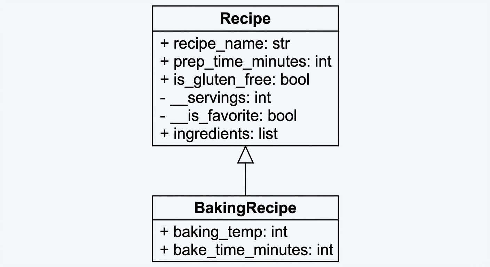
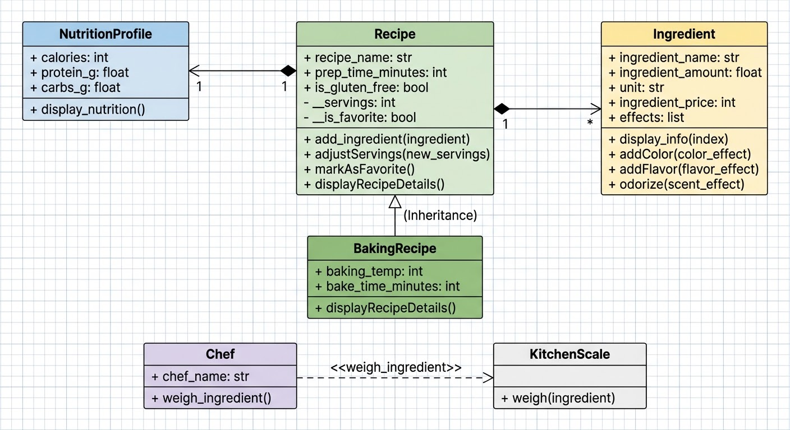

# Advanced Class Relationships
**Name:** Bashaier Calipes

**Section:** Platinum
## Previous Activities
* [classAttrib](classAttributesMethods.md)
* [classRel](classRelationships.md)

## Existing System Description
The system models culinary recipes, detailed ingredient tracking, nutritional breakdown analysis, and kitchen preparation workflows.

## Inheritance Relationship
* **Parent Class**: `Recipe`
* **Child Class**: `BakingRecipe`
* **Explanation**: `BakingRecipe` inherits core attributes (`recipe_name`, `prep_time_minutes`, `is_gluten_free`, `servings`) and methods (`adjustServings`, `markAsFavorite`) from `Recipe` while adding `baking_temp` and `bake_time_minutes`.

## Inheritance UML

## Composition/Aggregation
* **Relationship**: 
  * Composition: `Recipe` HAS-A `NutritionProfile`
  * Aggregation: `Recipe` HAS-A `Ingredient`
* **Explanation**: `NutritionProfile` is created inside the recipe constructor and shares its lifespan. `Ingredient` objects exist independently and are aggregated into the recipe.

## Advanced UML Diagram

## Python Implementation
[Source Code](advancedRelationships.py)

## Test Run

## Object Diagram

## Reflection
1. **Inheritance Choice**: `BakingRecipe` extends `Recipe` to add baking controls while preserving core recipe management features.
2. **Code Reduction**: Constructor logic and display behaviors were reused via `super().__init__()` and `super().displayRecipeDetails()`.
3. **Lifecycle Relationship**: `Ingredient` uses aggregation because ingredients exist independently in pantry inventories. `NutritionProfile` uses composition because nutritional metrics are generated specifically for that recipe.
4. **Association vs. Advanced Relationships**: Advanced relationships define memory lifecycles and strict structural roles rather than basic object pointers.
5. **DRY Principle**: Centralized parent code and modularized components prevented redundant declarations across classes.