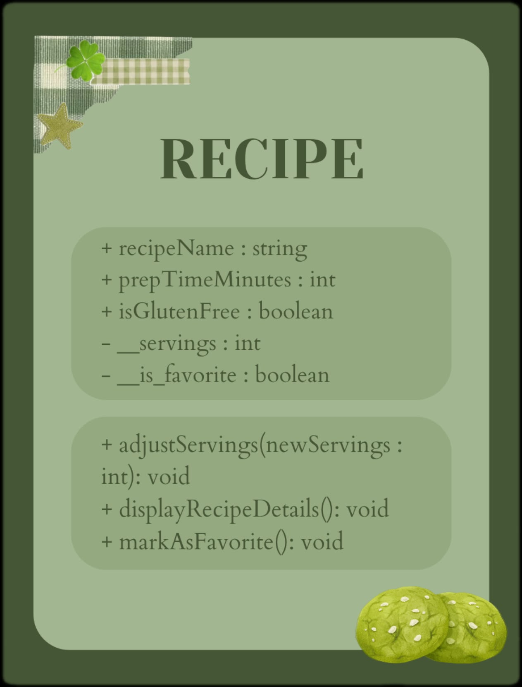
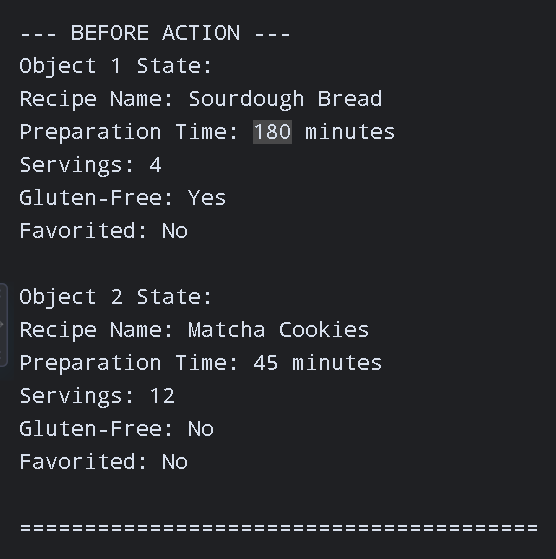
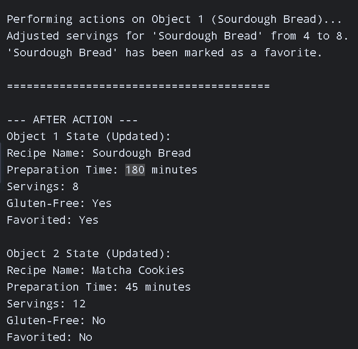
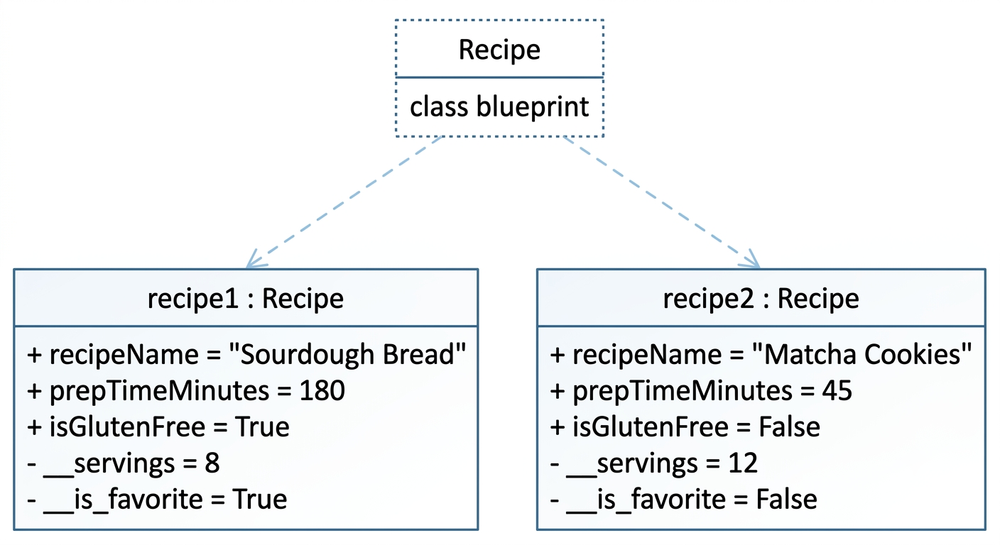

# Class Attributes and Methods
**Name:** Bashaier Calipes

**Section:** Platinum
## Previous Design
Link to my previous activity:
[classObjectUML.md](classObjectUML.md)

## Design Revision
Changes from my previous design:
Added visibility modifiers to properties and added an internal `__is_favorite` private attribute to support the `markAsFavorite()` method properly while encapsulating status changes.

## Visibility Decisions
| Attribute | Data Type | Visibility | Reason |
|---|---|---|---|
| `recipeName` | string | Public | Acts as a general descriptive identifier that can be read freely without breaking object logic. |
| `prepTimeMinutes` | integer | Public | General metadata that users may view or update directly if preparation details change. |
| `__servings` | integer | Private | Critical state property that requires validation via methods to prevent invalid values like zero or negative portions. |
| `__is_favorite` | boolean | Private | Safeguards internal application user state so it can only be flagged through explicit actions. |

## Updated UML Class Diagram

## Python Implementation
[View Python Source](classImplementation.py)

## Test Run 

## Object Diagram

## Analysis

### Why did you make your chosen attribute private?
I made __servings private so other parts of the program cannot change it directly to an impossible number, like zero or a negative amount. Making it private forces the program to use a dedicated method instead, which checks if the new number is valid before saving it and keeps the recipe data safe.
### Which method changes the state of your object?
The adjust_servings(new_servings) method changes the state of the recipe object. It receives a new number of portions as an input parameter and updates the private __servings attribute with that value.
### How did your two objects demonstrate that instances are independent?
When I changed the servings and favorite status on recipe1, only that specific object was updated in memory. The second object, recipe2, kept all of its original servings and remained unfavorited, proving that objects created from the same class operate completely separately.
### What is the difference between your class diagram and your object diagram?
The class diagram is a general blueprint that shows the overall layout, attribute names, data types, and method definitions for any recipe. In contrast, the object diagram shows actual recipes made from that blueprint at a specific moment in time, displaying real values like "Sourdough Bread" and 8 servings.
