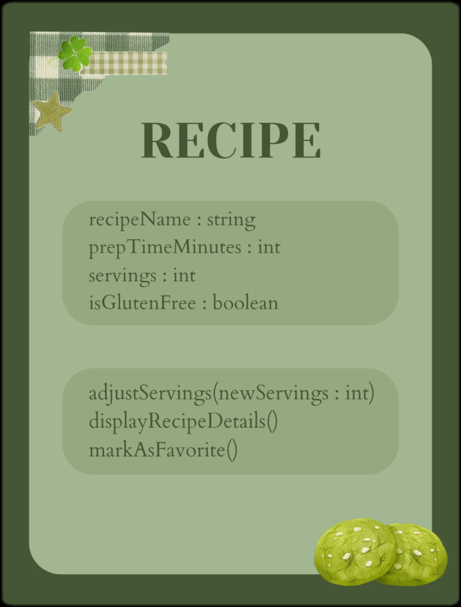

# SG4 - Understanding Classes and Objects
<<<<<<< HEAD

**Name:** Bashaier V. Calipes

**Section:** Platinum

**Date:**September 3, 2026

## Cake
### Class Description

### Properties
| Property | Data Type | Description |
|---|---|---|
| | | |
| | | |
| | | |
| | | |

### Methods
| Method | Description |
|---|---|
| | |
| | |
| | |

### Class Diagram

### Design Explanation

#### Why did you choose this class?
I chose this class becuase I love baking and cake is my specialty. It also has a lot of properties that can make my coding easier eme eme ganun.
#### Which property is the most important? Why?

#### Which method is the most useful? Why?
Data Field:
    Flavor: Pistachio 
    Color: Sage Green
    Size: Medium+
Methods:
    decorate()
    display()
=======
**Name:** Bashaier V. Calipes
**Section:** Platinum
**Activity:** OOPAct
## Class Name
Recipe
## Class Description
This class represents a specific baking or cooking recipe in a digital cookbook or kitchen inventory application. It manages core recipe properties, portion scaling, and preparation specifications.
## Properties

| Property | Data Type | Description |
| :--- | :--- | :--- |
| recipeName | string | The name or title of the baking dish (e.g., "Sourdough Bread") |
| prepTimeMinutes | int | Total time required to prepare and bake the recipe in minutes |
| servings | int | Number of portions or pieces the recipe produces |
| isGlutenFree | boolean | Indicates whether the dish is safe for gluten-free diets |

## Methods

| Method | Description |
| :--- | :--- |
| adjustServings(newServings: int) | Scales the recipe measurements and yield based on the target number of servings. |
| displayRecipeDetails() | Prints out the full recipe details including name, prep time, servings, and dietary flags. |
| markAsFavorite() | Flags the recipe as a favorite item for quick filtering in the cookbook app. |

## Class Diagram

## Design Explanation
### Why did you choose this class?
I chose Recipe because cooking and baking are my primary hobbies. Designing a class for recipes demonstrates how everyday cooking concepts translate into organized software structures for kitchen and recipe management apps.
### Which property is the most important? Why?
recipeName is the most important property because it acts as the primary identifier for the object, allowing users and the computer system to distinguish one recipe from another.
### Which method is the most useful? Why?
adjustServings(newServings: int) is the most useful method because bakers and cooks frequently need to scale recipe quantities up or down depending on how many people they are feeding.
>>>>>>> f51793614cb6945526d9684089073e40220f30c4
