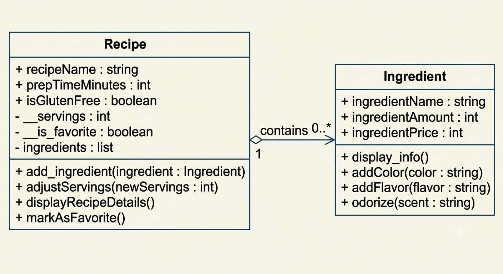

# Class Relationships: Association and Multiplicity

**Name:** Bashaier Calipes

**Section:** Platinum

## Previous Work

[Part I - Classes and Objects](classObjectUML.md)

[Part II - Class Attributes and Methods](classAttributesMethods.md)

## Existing Class
Class: Recipe

Description: This class represents a specific baking or cooking recipe in a digital cookbook or kitchen inventory application. It manages core recipe properties, portion scaling, and preparation specifications.

## New Related Class
Class: Ingredients

Description: Ingredients is a class that contains ingredient name, amount of ingredient, and price of ingredient. It can color(), flavor(), and odorize().

## Association
Relationship: Recipe contains ingredient.

Explanation: The Recipe can use Ingredients to add more details about a certain recipe.

## Multiplicity
Multiplicity: One-to-Many

Explanation: Each recipe contains a lot of ingredients. Therefore, the multiplicity of this relationship is One-to-Many.

## UML Class Relationship Diagram

## Python Implementation
[View Python Source](classRelationships.py)

## Test Run

## Object Relationship Diagram

## Analysis
### What is the association between your two classes?

### What multiplicity did you choose and why?

### How did you implement the relationship in Python?

### Why did you store an object reference instead of copying its data?

### If your relationship uses many, why is a list appropriate?
