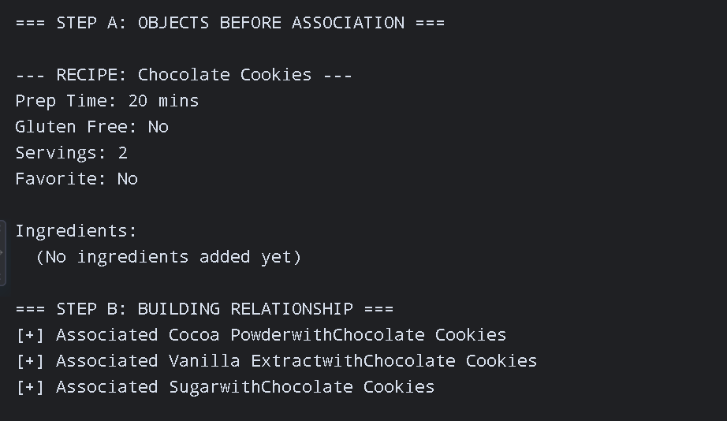
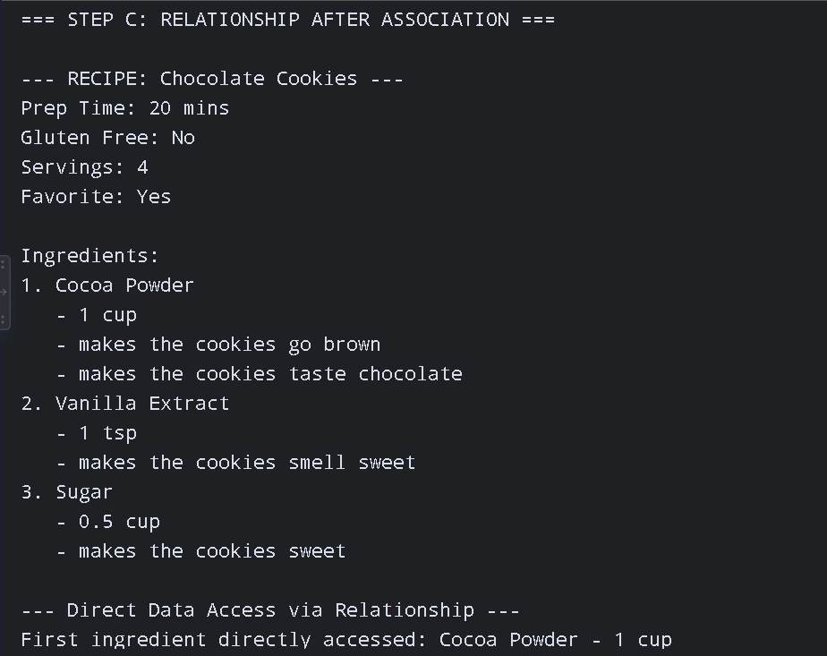
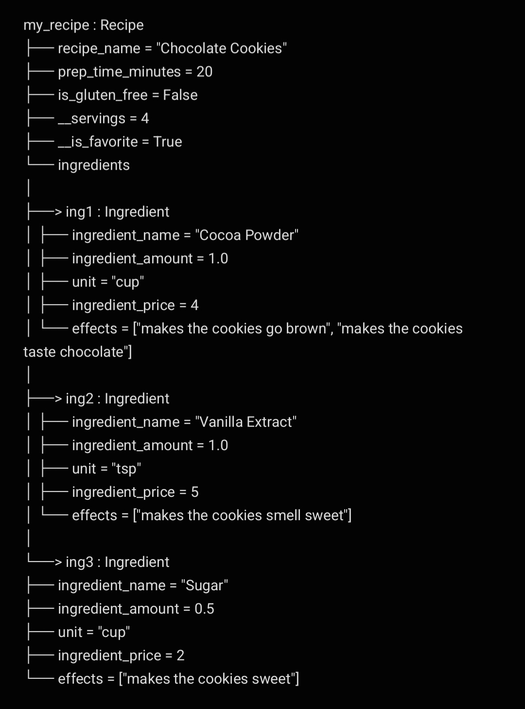

# Class Relationships: Association and Multiplicity

**Name:** Bashaier Calipes

**Section:** Platinum

## Previous Work

[Part I - Classes and Objects](classObjectUML.md)

[Part II - Class Attributes and Methods](classAttributesMethods.md)

## Existing Class
**Class:** Recipe

**Description:** This class represents a specific baking or cooking recipe in a digital cookbook or kitchen inventory application. It manages core recipe properties, portion scaling, and preparation specifications.

## New Related Class
**Class:** Ingredients

**Description:** Ingredients is a class that contains ingredient name, amount of ingredient, and price of ingredient. It can addcolor(), addflavor(), odorize(), and displayInfo().

## Association
**Relationship:** Recipe contains ingredient.

**Explanation:** The Recipe can use Ingredients to add more details about a certain recipe.

## Multiplicity
**Multiplicity:** One-to-Many

**Explanation:** Each recipe contains a lot of ingredients. Therefore, the multiplicity of this relationship is One-to-Many.

## UML Class Relationship Diagram

## Python Implementation

## Test Run

  
## Object Relationship Diagram

## Analysis
### What is the association between your two classes?
The association between Recipe and Ingredient is a "has-a" container relationship. The Recipe class acts as the main manager that contains and organizes multiple Ingredient objects. The Recipe relies on these associated Ingredient objects to access their individual attributes (such as name, amount, unit, and price) and display the full recipe details.

### What multiplicity did you choose and why?
I chose a 1 to 0..* (one-to-many) multiplicity. This is appropriate because a single Recipe instance can start with zero ingredients before any are added, or it can hold many Ingredient objects as the recipe is built. Meanwhile, each ingredient instance added to the recipe's collection directly belongs to that specific recipe context.

### How did you implement the relationship in Python?
The relationship is implemented by creating an attribute called self.ingredients = [] inside the Recipe class constructor. I then defined an add_ingredient(self, ingredient) method inside Recipe that accepts an actual Ingredient object as a parameter and appends it to the self.ingredients list.

### Why did you store an object reference instead of copying its data?
I stored object references (e.g., self.ingredients.append(ingredient)) so the Recipe could directly interact with the full functionality of each Ingredient object. By keeping the actual reference, the recipe can call ingredient methods like display_info(), addColor(), addFlavor(), and odorize() without redundantly storing separate string or float values for every property inside the recipe.

### If your relationship uses many, why is a list appropriate?
A Python list is appropriate because it is a dynamic, ordered collection capable of storing multiple object references in sequence. It allows the Recipe class to add an unlimited number of Ingredient objects using .append(), keep them in the exact order they were added, and easily iterate through them using a for loop to display their details.
