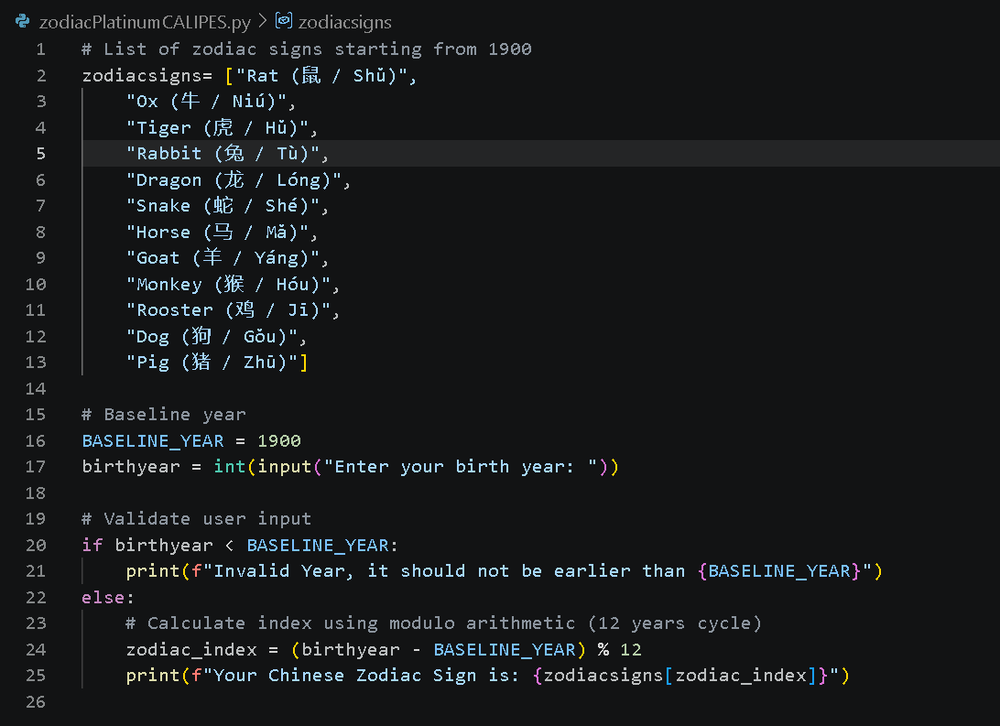
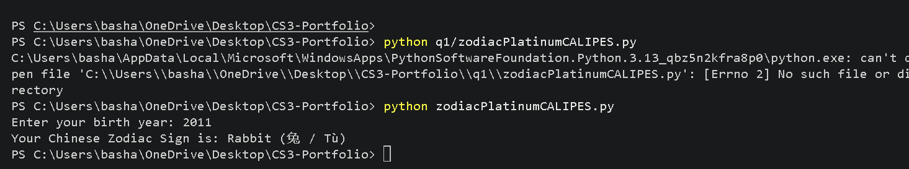

# Chinese Zodiac Sign Finder
**Name:** Bashaier V. Calipes  

**Section:** Platinum  

**Date:** Aug 20, 2026  

---

### Requirements
Create a Python program that determines the Chinese Zodiac sign based on a given birth year (baseline year: 1900).
* Input must not be earlier than 1900.
* Abort/display an error message if the year is invalid.
* Zodiac recurs every 12 years starting from 1900 (Rat).

---
### Screenshots



---

### Python Code (`zodiacPlatinumCALIPES.py`)
```python
zodiac_signs = [
    "Rat (鼠 / Shǔ)", "Ox (牛 / Niú)", "Tiger (虎 / Hǔ)", 
    "Rabbit (兔 / Tù)", "Dragon (龙 / Lóng)", "Snake (蛇 / Shé)", 
    "Horse (马 / Mǎ)", "Goat (羊 / Yáng)", "Monkey (猴 / Hóu)", 
    "Rooster (鸡 / Jī)", "Dog (狗 / Gǒu)", "Pig (猪 / Zhū)"
]

BASELINE_YEAR = 1900
birth_year = int(input("Enter your birth year: "))

if birth_year < BASELINE_YEAR:
    print(f"Invalid Year, it should not be earlier than {BASELINE_YEAR}")
else:
    zodiac_index = (birth_year - BASELINE_YEAR) % 12
    print(f"Your Chinese Zodiac Sign is: {zodiac_signs[zodiac_index]}")

